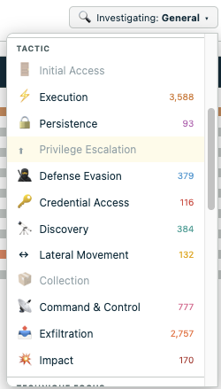
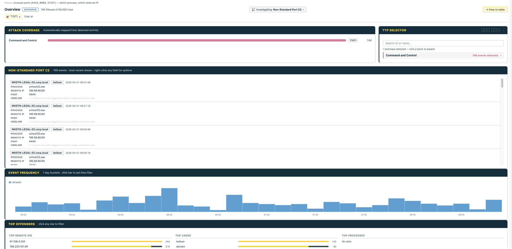
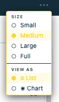
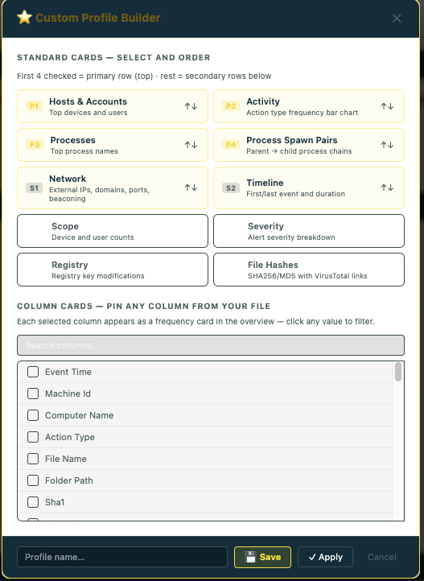

# Sift — Threat Hunting & Incident Response Investigation

A browser-based, offline investigation tool for security analysts and IT professionals. Load a log file, get an adaptive MITRE ATT&CK-driven dashboard, process tree, network map, script decoder, and query builder — all without installing anything.


## Quick start

1. Download the right `.html` file from [`dist/`](dist/) — most users want `hunt-investigator.html`
2. Open it in **Chrome** or **Microsoft Edge**
3. Drag your CSV (or `.evtx`) onto the page

That's it. No install, no server, no setup.

## Why Sift

- **Adaptive** — auto-detects Defender, Chronicle, or Windows Security and unlocks only the features that match
- **MITRE ATT&CK-aware** — runs technique detection signatures over your data, surfaces which tactics fired and where
- **Built for triage** — click anything to filter, every card stays in sync, jump to a filtered table in one click
- **Analyst-friendly tooling** — process tree, network map with beaconing detection, PowerShell/base64 decoder, multi-IOC query builder
- **Fully offline** — single HTML file, no install, no telemetry, runs entirely in your browser

## Privacy & security

Sift is **fully air-gapped capable**. It is a single static HTML file that runs entirely in your browser. There is no server component, no analytics, no telemetry, and no external resource loading at runtime — the file is self-contained with all JavaScript and CSS inlined. Your log data never leaves the machine you opened the file on, and the source is fully open for audit at [github.com/rvicenciojr/Sift-ThreatHuntingInvestigator](https://github.com/rvicenciojr/Sift-ThreatHuntingInvestigator).

## Performance & limits

Sift parses CSVs in a web worker so the UI stays responsive on large files. Practical sizing guidance:

| Rows | Experience |
|---|---|
| Under 100k | Instant load, all features snappy |
| 100k – 500k | Good. Initial parse ~5–15 s, overview ~2–4 s. Process Tree and Network Map work well |
| 500k – 1M | Workable. Parse 15–40 s. Consider filtering before opening heavy tools |
| 1M+ | Possible but slow. Browser tab memory can become the bottleneck — split large exports by host/time window first |

If a file feels sluggish, narrow the export at the source (Chronicle/Defender query) before loading rather than loading everything and filtering in Sift.

---

## Contents

- [For analysts — getting started](#for-analysts--getting-started)
- [Overview Dashboard](#overview-dashboard)
- [🌲 Process Tree](#-process-tree)
- [Other Analysis Tools](#other-analysis-tools)
- [Table view](#table-view)
- [Filter Bar](#filter-bar)
- [Right-Click Context Menu](#right-click-context-menu)
- [Keyboard & Mouse](#keyboard--mouse)
- [Typical investigation workflow](#typical-investigation-workflow)
- [FAQ & troubleshooting](#faq--troubleshooting)
- [Supported log sources](#supported-log-sources)
- [For developers — building and modifying](#for-developers--building-and-modifying)

---

## For analysts — getting started

### Which file do I open?

| File | Use when you have |
|---|---|
| `hunt-investigator.html` | Google Chronicle exports **or** Microsoft Defender for Endpoint CSVs (main work file) |
| `sift-generic.html` | **Any CSV** — no security tooling required, works for IT, networking, ops, audit |
| `sift-windows.html` | Windows Security Event Log CSVs or `.evtx` files |
| `sift-defender.html` | Microsoft Defender for Endpoint only |
| `sift-chronicle.html` | Google Chronicle / UDM only |
| `sift-defender-windows.html` | Defender CSVs **and** Windows Event Logs in the same investigation |
| `sift-chronicle-windows.html` | Chronicle CSVs **and** Windows Event Logs in the same investigation |

### Opening the tool

1. Get the right HTML file from the `dist/` folder (or from whoever sent it to you)
2. Open it in **Chrome** or **Microsoft Edge**
3. Drag and drop your log file onto the page, or click **📂 Open CSV**

That's it. One file, nothing else needed. Works completely offline.


> **Supported browsers:** Chrome or Microsoft Edge (Chromium). Not compatible with Safari or Internet Explorer.

### Working with multiple files (Tabs)

Drop a second file onto Sift and it opens in a new tab. The tab bar appears at the top of the page once you have more than one. Each tab keeps its own data, filters, column visibility, timestamp range, highlights, and investigation profile — switching tabs is instant. Close a tab with × on the tab itself.

By default each tab is isolated. Toggle **Share filters & highlights across tabs** in the filter bar if you want one filter set to apply everywhere — useful when triaging the same IOC across several exports.

### Toolbar & View settings (⚙ View)

The **⚙ View** button (top-right of the header) opens a small settings panel:

| Setting | Effect |
|---|---|
| **Detail view** | Toggles between **Sidebar** (row detail opens as a side panel — table stays visible) and **Modal** (row detail opens centered, full focus). Sidebar is the default and recommended for triage. |
| **Sidebar panel** | When in Sidebar mode, expands/collapses the panel so it doesn't take screen real estate when not needed. |
| **Theme** | Light / dark. Picks up your OS preference on first load and remembers your choice. |

Click any row in the table (or the **→** chevron) to open the detail view. Use arrow keys ← / → to navigate row-by-row without closing it.

---

## Overview Dashboard

Open with **📋 Overview** in the analysis toolbar — this is the main starting point after loading data.


### Visualization cards (all variants)

| Card | Shows |
|------|-------|
| **Event Frequency Timeline** | Stacked bar chart of events over time, colored by event category. Click any bar to set time filter to that window |
| **Top Offenders** | Top source IPs (failed logons), targeted accounts, spawned processes — each row clickable to filter |
| **Attack Chain** | Events in chronological order grouped into attack stages (Windows Security Event Logs only) |

### ATT&CK Coverage Card

Runs MITRE ATT&CK detection signatures against your data and shows which tactics fired with hit counts. When a tactic or technique is selected in the Investigating dropdown, the coverage card filters to show only that tactic's bar.

### TTP Selector

Shows all tactics with detected techniques. Click a tactic to expand and see individual techniques with hit counts. When a tactic is selected, only that tactic's techniques are shown. Search by technique ID (T1059) or name (PowerShell).



### Investigation Profiles

The **"Investigating: ▾"** dropdown reshapes the dashboard for a specific investigation type. It has three sections:

**Custom Profiles** (top) — any profiles you've saved appear here for one-click recall.

**General IT** — non-security profiles useful for any structured log data:


| Profile | Primary cards | Best for |
|---------|--------------|----------|
| 🌐 Network | Network · Timeline · Hosts | Firewall logs, proxy logs, DHCP, DNS |
| 👤 User Activity | Hosts & Accounts · Timeline · Activity | Audit logs, compliance, HR investigations |
| 📁 File Operations | Processes · Hosts · Timeline | Storage logs, DLP exports, data governance |
| ⚙️ System Changes | Registry · Activity · Timeline | Change management logs, config drift |
| 📊 Performance | Processes · Activity · Timeline | Monitoring exports, ops logs |

**Tactic** *(threat hunting variants only)* — MITRE ATT&CK tactics with detected technique counts:


**Technique profiles** (appear only when detected in your data):

T1003.001 LSASS Dump · T1003.002 SAM Dump · T1003.003 NTDS Dump · T1003.006 DCSync · T1021.001 RDP · T1021.002 SMB · T1021.006 WinRM · T1027 Obfuscation · T1047 WMI · T1053.005 Scheduled Task · T1055.001 DLL Injection · T1055.012 Process Hollowing · T1059.001 PowerShell · T1059.003 Cmd Shell · T1059.005 VBScript · T1059.007 JavaScript · T1069.001/002 Group Discovery · T1070.001 Clear Event Logs · T1071 C2 · T1082 System Info Discovery · T1087.001/002 Account Discovery · T1105 Ingress Tool Transfer · T1110.003 Password Spraying · T1136.001/002 Create Account · T1187 Forced Authentication · T1197 BITS Jobs · T1204.002 Malicious File · T1218.011 Rundll32 · T1219 Remote Access Software · T1482 Domain Trust Discovery · T1485 Data Destruction · T1486 Ransomware · T1489 Service Stop · T1490 Inhibit Recovery · T1496 Cryptomining · T1505.003 Web Shell · T1529 System Shutdown · T1543.003 Windows Service · T1546.003 WMI Subscription · T1547.001 Registry Run Keys · T1548.002 Bypass UAC · T1550.002 Pass the Hash · T1550.003 Pass the Ticket · T1552.001/002 Credentials · T1555.003 Browser Creds · T1558.001 Golden Ticket · T1558.003 Kerberoasting · T1560.001 Archive via Utility · T1562 Impair Defenses · T1562.001 Disable Security Tools · T1567.002 Cloud Storage Exfil · T1569.002 Service Execution · T1570 Lateral Tool Transfer · T1571 Non-Standard Port · T1572 Protocol Tunneling

When you pick a technique profile, a **TTP Context Card** appears at the top of the Overview showing the per-event detail rows for that technique — host, user, process, command line, remote IP, port, and any other fields relevant to that TTP. Click any field to filter by it, right-click for the full context menu.



### Card Settings — ··· Menu

Every overview card has a **···** button on the far right of the title bar. Click it to open a compact dropdown with two sections:



**Size** — controls the card's width in the grid:
| Option | Width |
|--------|-------|
| Small | ~25% |
| Medium | ~33% (default) |
| Large | ~50% |
| Full | 100% |

**View as** *(appears on supporting cards)* — toggle between list and pie/donut chart:
- Activity, Processes, Hosts & Accounts, Network IPs all support this
- Chart slices are clickable to filter, same as list rows

### Drag to Reorder & Resize Cards

**⠿ Drag handle** — grab and drag any card to a new position. A ghost of the card follows your cursor and a dashed placeholder shows the drop target. Release to commit the new order.

**Right-edge handle** — a thin vertical grip on the right side of each card. Drag left/right to resize the card width, snapping to Small/Medium/Large/Full. A tooltip shows the current size as you drag.

**Bottom-edge handle** — a thin horizontal grip at the bottom of each card. Drag down to make the card taller, up to shrink it. The inner scrollable area expands with the card. Drag close to the original height to snap back to auto.

### Custom Profiles

Click **＋ Build custom profile…** at the bottom of the Investigating dropdown to open the profile builder:



**Standard Cards** — choose which overview cards to show and in what order. Cards marked `P1–P4` appear in the primary top row; `S1+` appear in secondary rows below.

**Column Cards** — pin any column from your loaded file as a frequency card. All columns from your CSV are displayed as a scrollable checklist — click to select/deselect. Selected columns appear as overview cards showing top values with click-to-filter.

**Save** persists the profile to browser localStorage — it reappears at the top of the Investigating dropdown. **Apply** uses it for this session only.

When a custom profile is active, the overview shows **only** the cards you selected — MITRE coverage, indicators, Top-N, and the frequency timeline are suppressed for a clean focused view.

### Custom Field Cards

The **＋ Field** button in the overview header lets you pin any column as a frequency card without building a full custom profile. Cards show top 25 values with click-to-filter. Dismiss with × to remove.

### Windows Security specific cards

These appear automatically when Security event logs are loaded:

| Card | Shows | EventIDs |
|------|-------|---------|
| **Logon Analysis** | Success vs failed counts, logon type breakdown, failed ratio | 4624 / 4625 |
| **Spray / Brute Force** | Source IPs hitting multiple accounts, accounts hit from multiple sources | 4625 patterns |
| **Account Changes** | Account creation, group membership, disables, deletes | 4720/4722/4725/4726/4728/4732/4740/4756 |
| **Authentication Events** | Kerberos TGT requests, service tickets, pre-auth failures | 4768/4769/4770/4771/4776 |
| **Network Logons** | Type 3/10 logons — lateral movement paths | 4624 with LogonType 3 or 10 |
| **RDP Sessions** | RDP connect, reconnect, logoff timeline | 21/22/23/24/25/131 |

### Notable Indicators

Always shown at the bottom, sorted by active profile relevance.

| Severity | Rule |
|----------|------|
| 🔴 Critical | Encoded PowerShell (-enc / -encodedCommand) |
| 🔴 Critical | Inline Base64 decode (FromBase64String) |
| 🔴 Critical | Office application spawning shell |
| 🔴 Critical | Credential dumping (lsass, mimikatz, comsvcs MiniDump) |
| 🔴 Critical | Process injection patterns |
| 🔴 Critical | Web server spawning shell (web shell activity) |
| 🔴 Critical | Forced authentication / NTLM capture tool |
| 🔴 Critical | Data destruction command pattern |
| 🟠 High | Scheduled task creation |
| 🟠 High | WMI remote execution |
| 🟠 High | Service installation or modification |
| 🟠 High | LOLBin usage (certutil, mshta, rundll32, regsvr32, wscript, bitsadmin) |
| 🟠 High | PowerShell download cradle |
| 🟠 High | Remote access software detected (AnyDesk, TeamViewer, ScreenConnect, ngrok) |
| 🟠 High | BITS job used for download or persistence |
| 🟠 High | Account creation command detected |
| 🟠 High | Critical service stopped (backup/AV/database) |
| 🟠 High | Cloud storage contact (potential exfiltration) |
| 🟠 High | Execution from suspicious path (%TEMP% / AppData / Public) |
| 🟠 High | Heavily obfuscated / long command line (>500 chars) |
| 🟡 Medium | High-port outbound connections (>49151) |
| 🟡 Medium | Suspicious TLD contact (.xyz, .top, .tk, .ru, .pw, .cc) |
| 🟡 Medium | Domain trust discovery |
| 🟡 Medium | Lateral tool transfer via admin share |

---

## 🌲 Process Tree


Hierarchical parent/child process view. Click any node for full detail: cmdline, hashes, network events, registry changes. Filter by host or search by process/cmdline/IP. Respects active filters — scoped to your current filtered dataset.

**Chronicle UDM action type categories:**

| Category | Color | UDM event types |
|----------|-------|----------------|
| Process | 🔴 Red-orange | `PROCESS_LAUNCH` · `PROCESS_TERMINATION` |
| Network | 🔵 Blue | `NETWORK_CONNECTION` · `DNS_QUERY` · `DNS_LOOKUP` |
| File | 🟣 Purple | `FILE_CREATION` · `FILE_MODIFICATION` · `FILE_DELETION` |
| Registry | 🟠 Amber | `REGISTRY_VALUE_SET` · `REGISTRY_VALUE_DELETION` |
| Logon | 🩷 Pink | `USER_LOGIN` · `USER_LOGOUT` |
| Other | 🟢 Green | All other event types |

**Windows Security action type categories:**

| Category | Color | EventIDs |
|----------|-------|---------|
| Process | 🔴 Red | 4688 Process Created, 4689 Terminated |
| Logon / Auth | 🔵 Blue | 4624 Success, 4634 Logoff, 4648 Explicit, 4776 NTLM |
| Auth Failure | 🔴 Bright Red | 4625 Failed Logon, 4740 Lockout, 4771 Kerberos Failure |
| Kerberos | 🩵 Teal | 4768 TGT Request, 4769 Service Ticket, 4770 Renew |
| Script / PS | 🟠 Orange | 4103/4104 PowerShell Logging, 4697/7045 Services, 4698 Scheduled Tasks |
| Account Changes | 🟣 Purple | 4720 Create, 4725 Disable, 4726 Delete, 4738 Modify |
| Group Changes | 🟣 Violet | 4728/4732/4756 Group Membership |
| Log / Policy | 🩷 Pink | 1102/1100 Log Clear, 4719 Audit Policy Change |

---

## Other Analysis Tools

All tools respect active filters — scoped to your current filtered dataset.

### 🗺 Network Map


Pick a connection type (HTTPS, HTTP, SMB, WinRM, DNS, RDP, Other) to render only those flows.


Force-directed canvas graph of process → IP connections. Edge width = connection frequency. Detects beaconing (regular-interval connections). Click any node for detail.

### 🔍 Script Decoder


Detects and decodes:

| Source | How detected |
|--------|-------------|
| **4104 Script Block Logging** | EventID == 4104 |
| **4103 Module Logging** | EventID == 4103 |
| **Encoded PowerShell (-enc)** | Regex on CommandLine — decodes UTF-16LE base64 |
| **FromBase64String** | Regex on CommandLine — decodes inline base64 |

### 📊 Timeline


Event distribution chart. Drag to select a time range — table updates on release. Double-click to reset. Quick-picks: 1h · 6h · 12h · 1d · 1w · 1mo.

### 📈 Bytes Chart

Network traffic volume (bytes in/out per time bucket). Requires bytes columns in the export.

### 🔨 Query Builder

*(Security variants only — not available in sift-generic)*

Floating draggable panel. Right-click any value → "Add to Query Builder" to accumulate IOCs. Toggle AND/OR logic.

- **Defender** → Advanced Hunting KQL
- **Chronicle** → UDM search query
- **Windows Security** → Sentinel SecurityEvent KQL

---

## Table view


The main data grid — sortable columns, row-level highlights, filter controls in the bar above. The pagination bar (row count, Export, navigation) is only visible in table view — it hides automatically when the Overview is open and returns when you leave it. Navigation controls only appear when data spans multiple pages.

### Cell Selection & Copy

- **Click and drag** across cells to select a range (Excel-style blue highlight)
- **Shift+click** extends the selection from the starting point
- **Ctrl/Cmd+C** copies the selected cells as tab-separated values (paste into Excel)
- **Right-click** on selected cells → `Copy selection` (TSV) or `Copy selection as JSON`

---

## Filter Bar

| Control | What it does |
|---------|-------------|
| ＋ Add filter row | Adds a condition with column, match mode, and value |
| Match modes | contains · does not contain · equals · starts with · ends with · matches regex · not regex |
| AND / OR | Connector between filter rows — combine conditions any way you need |
| ✕ Clear all | Removes all filters and resets to full dataset |
| ⊞ Columns | Show/hide columns, drag ⠿ grip to reorder |
| ⭐ Presets | Save and reload named filter configurations |
| 🎨 Highlights | Colour-code rows by term — see Highlights section below |
| ☑ Filters enabled | Temporarily disable all filters without deleting them |
| 🎯 TTP chip | Auto-added when you click a TTP in the Overview |

**Regex filters:** If a regex pattern is invalid, the filter input shows a red border and tooltip with the error. The filter passes all rows rather than silently hiding everything.

**OR logic:** Multiple filter rows with OR connectors correctly combine — blank filter rows are excluded from evaluation so they don't interfere with OR results.

**Column reordering:** Right-click any column header → Move left / Move right / Move to first / Move to last. Or drag column headers directly.

**Per-tab state:** Filter rows, column filters, timestamp range, highlights, and investigation profile are all saved per tab and restored when switching back.

### TTP chip

When you click a technique in the Overview (e.g. T1059.001 PowerShell from the TTP Selector or a Notable Indicator), Sift adds a yellow chip to the filter bar: `🎯 T1059.001 · PowerShell`. This applies the detection signature for that technique as a filter — the table shows only the rows that matched it. Click the × on the chip to remove it and return to the full dataset.

### Highlights

Highlights colour-code matching rows so anomalies pop out as you scroll. Open the panel with **🎨 Highlights**.

**Pre-loaded threat-hunting terms** — Sift ships with these defaults so the most common suspicious strings light up immediately on first load:

| Term | Colour |
|---|---|
| `powershell`, `encoded`, `base64`, `mimikatz` | 🔴 Red |
| `rundll32`, `mshta` | 🟠 Orange |
| `certutil` | 🟡 Yellow |

Add, edit, or delete terms freely. Up to 9 colours are available. Use **💾 Save highlights** to persist your custom set across sessions — they live in browser localStorage. **↺ Reset** restores the pre-loaded defaults.

**Severity auto-highlights** *(Chronicle only)* — when Chronicle data is detected, Sift automatically applies highlights by `security_result.severity`: CRITICAL rows red, HIGH amber, MEDIUM yellow, LOW green. This applies once on first load — you can edit or remove these rules like any other highlight.

**🎯 Show highlighted** — toggle on to filter the table to rows that match any highlight rule. Quick way to focus only on flagged events without writing a multi-row filter.

---

## Right-Click Context Menu


Available everywhere — table cells, overview rows, context card fields, process tree nodes, network map nodes, script decoder entries.

| Option | Description |
|--------|-------------|
| Filter by this value | Adds a contains filter |
| Exclude this value | Adds a does-not-contain filter |
| Copy value | Copies raw value |
| Copy row as JSON | Full row as formatted JSON |
| Copy Chronicle UDM query | Schema-accurate UDM search |
| Copy Defender KQL | Schema-accurate Advanced Hunting KQL |
| Copy Sentinel KQL | SecurityEvent KQL (Windows Security logs) |
| Add to Query Builder | Adds to the floating multi-IOC panel *(security variants only)* |
| Copy selection | Copies selected cells as tab-separated values |
| Copy selection as JSON | Copies selected cells as JSON |
| VirusTotal | Opens VT search for IPs, hashes, domains, URLs |
| Shodan | Opens Shodan for IPs |
| CyberChef | Opens CyberChef with value pre-loaded |

---

## Keyboard & Mouse

| Action | Where | Result |
|--------|-------|--------|
| Escape | Anywhere | Close open modal / sidebar / picker |
| Arrow left / right | Row detail open | Navigate to previous / next row |
| Ctrl/Cmd+C | Cells selected | Copy as tab-separated values |
| Hover list + type letters | Overview scrollable lists | Typeahead jump to first matching item |
| Hover TTP Selector + type | Overview TTP panel | Keystrokes route to search box |
| Drag on timeline | Timeline chart | Select time range |
| Double-click on timeline | Timeline chart | Clear time range filter |
| Drag column header | Table header | Reorder column |
| Right-click column header | Table header | Move / Sort / Hide |
| Click + drag in table | Table cells | Select a range of cells (Excel-style) |
| Shift + click | Table cells | Extend selection |

---

## Typical investigation workflow

```
1. Load file
   └── Tool auto-detects Defender, Chronicle, or Windows Security and unlocks relevant features

2. Open Overview  (📋 button in toolbar)
   └── ATT&CK Coverage shows which tactics and techniques fired immediately
   └── Event Frequency Timeline shows when activity happened colored by event type
   └── Top Offenders shows top source IPs, targeted accounts, spawned processes
   └── Notable Indicators surface suspicious patterns automatically
   └── Windows Security: Logon Analysis, Spray Detection, Account Changes, Kerberos Events

3. Pick an Investigation Profile  ("Investigating: ▾" dropdown)
   └── General IT profiles available in all variants (Network, User Activity, File Ops, etc.)
   └── MITRE tactic profiles in security variants (Execution, Lateral Movement, etc.)
   └── Dashboard reshapes — most relevant cards move to the top
   └── TTP Context Card appears with full per-event detail when a technique profile is selected

4. Click anything in the dashboard to build your filter
   └── Every row, chip, and indicator is clickable — adds a filter and stays in overview
   └── All cards update live as filters stack
   └── Active filter strip shows what is active with × to remove each layer

5. Hit "→ View in table" when ready
   └── Jumps to raw table showing exactly the filtered rows
   └── All filters remain active in the filter bar
   └── Click 📋 Overview again to return to the dashboard

6. Deep dive with analysis tools  (security variants)
   └── 🌲 Process Tree — full parent/child chain for affected hosts
   └── 🗺 Network Map — process-to-endpoint graph with beaconing detection
   └── 🔍 Script Decoder — decoded PowerShell and AMSI content
   └── All tools respect active filters — scoped to your current filtered dataset

7. Build SIEM queries  (security variants)
   └── Right-click any value → Copy Defender KQL, Chronicle UDM, or Sentinel KQL
   └── Query Builder accumulates multiple IOCs into a single query
```

---

## FAQ & troubleshooting

### My file loads but the Overview is empty / says "no data"

Check that your file actually has rows (CSV header only = no data). If you exported from Defender or Chronicle, confirm the query returned results. If the file has rows but Sift shows nothing, the timestamp column may be in an unsupported format — open the table view and verify the timestamp column has parsable values.

### Some cards are missing from the Overview

Sift only builds cards it has data for. The most common causes:

- **Registry card missing (Defender)** — your Advanced Hunting query didn't include `DeviceRegistryEvents`
- **Network card missing (Defender)** — query didn't include `DeviceNetworkEvents`
- **Process Tree button hidden** — no parent process column was detected in the export
- **Hashes card missing** — no SHA256 / MD5 columns in the export
- **MITRE coverage shows nothing** — data lacks command lines or action types to evaluate signatures against

For Defender exports, the cards are gated by which Advanced Hunting tables you joined in the query.

### Why doesn't it work in Firefox / Safari?

Sift uses Chromium-specific File System APIs and worker patterns that aren't reliably supported in Firefox or Safari. Use Chrome or Microsoft Edge.

### How do I get this approved by my company?

Show your security team three things: (1) the source is open at [github.com/rvicenciojr/Sift-ThreatHuntingInvestigator](https://github.com/rvicenciojr/Sift-ThreatHuntingInvestigator) under MIT license, (2) the file is a single self-contained HTML — no external network calls at runtime, no install, no telemetry, (3) it can run on an air-gapped workstation. Defensive use only. Audit the source if needed — the dist files inline the same JS that's in `src/`.

### Can I use this with Splunk / Sentinel / Elastic exports?

Yes — use `sift-generic.html`. Sift scans column names and builds whatever cards it has data for. You won't get the threat-hunting intelligence layer (MITRE coverage, process tree, etc.) but you get the overview, timeline, filters, and table view.

### My file is huge and the page is slow

See [Performance & limits](#performance--limits). Filter at the source query before loading — narrowing a Chronicle UDM query by host or time window before export is far faster than loading 5M rows and filtering in Sift.

### My CSV uses comma in field values and everything is misaligned

Sift's parser handles quoted fields per RFC 4180. If your export is malformed (unquoted commas in field values), it won't parse cleanly — re-export with proper CSV quoting, or use a tab-separated file (Sift also handles TSV).

### Can I send the HTML file to a colleague?

Yes. The file in `dist/` is fully self-contained — JS, CSS, and all dependencies are inlined. Send the HTML, nothing else needed. They can open it offline.

### How do I report a bug or request a feature?

Open an issue on [GitHub](https://github.com/rvicenciojr/Sift-ThreatHuntingInvestigator/issues).

---

## Supported log sources

### Microsoft Defender for Endpoint

**How to export:** Advanced Hunting → run your KQL query → Export → CSV

Auto-detected by: `ActionType`, `InitiatingProcessFileName`, `ProcessCommandLine`, `ReportId`

**Features unlocked:** Process Tree · Network Map · Script Decoder · All TTP context cards · Registry card · Hash card with VirusTotal links · Defender KQL query building

| Feature | Defender columns |
|---------|-----------------|
| Timestamp | `Event Time` / `Timestamp` |
| Device | `Computer Name` / `DeviceName` |
| User | `Account Name` / `InitiatingProcessAccountName` |
| Action type | `Action Type` / `ActionType` |
| Process name | `File Name` / `FileName` |
| Command line | `Process Command Line` / `ProcessCommandLine` |
| Parent process | `Initiating Process File Name` / `InitiatingProcessFileName` |
| Parent cmdline | `Initiating Process Command Line` / `InitiatingProcessCommandLine` |
| Remote IP | `Remote IP` / `RemoteIP` |
| Remote URL | `Remote Url` / `RemoteUrl` |
| Remote port | `Remote Port` / `RemotePort` |
| Registry key | `Registry Key` / `RegistryKey` |
| SHA256 | `Sha256` / `Initiating Process SHA256` |
| MD5 | `MD5` / `Initiating Process MD5` |
| Process integrity | `Process Integrity Level` / `ProcessIntegrityLevel` |

> **Tip:** If a card is missing, check that your Advanced Hunting query includes the relevant table. Registry card requires `DeviceRegistryEvents`. Network card requires `DeviceNetworkEvents`.

---

### Google Chronicle / SecOps

**How to export:** Search/Detections → run UDM query → Export results → CSV

Auto-detected by: `metadata.event_type`, `principal.hostname`, `security_result.severity`

**Features unlocked:** Process Tree · Network Map · Severity card · Severity auto-highlights · All TTP context cards · Registry card · Hash card with VirusTotal links · YARA-L generation · Chronicle UDM query building

| Feature | Chronicle UDM fields |
|---------|---------------------|
| Timestamp | `metadata.event_timestamp` / `udm.metadata.event_timestamp` |
| Device | `principal.hostname` / `udm.principal.hostname` |
| User | `principal.user.userid` / `udm.principal.user.userid` |
| Action type | `metadata.event_type` / `udm.metadata.event_type` |
| Process name | `principal.process.file.full_path` |
| Command line | `principal.process.command_line` |
| Parent process | `principal.process.parent_process.file.full_path` |
| Parent cmdline | `principal.process.parent_process.command_line` |
| Remote IP | `target.ip` / `udm.target.ip` |
| Remote port | `target.port` / `udm.target.port` |
| Remote URL / hostname | `target.hostname` |
| Registry key | `target.registry.registry_key` |
| Registry value | `target.registry.registry_value_name` |
| Registry data | `target.registry.registry_value_data` |
| SHA256 | `principal.process.file.sha256` |
| Severity | `security_result.severity` / `udm.security_result.severity` |
| Target user | `target.user.userid` |

---

### Windows Security Event Logs

**How to export:**

```powershell
# Option 1 — PowerShell (all Security events)
Get-WinEvent -LogName Security |
  Select-Object TimeCreated,Id,Message,MachineName |
  Export-Csv C:\security_events.csv -NoTypeInformation

# Option 2 — Specific EventIDs only
Get-WinEvent -FilterHashtable @{LogName='Security'; Id=4688,4624,4625,4648,4720,4728} |
  Select-Object * | Export-Csv C:\filtered_events.csv -NoTypeInformation
```

```
# Option 3 — EvtxECmd (Eric Zimmerman tools)
EvtxECmd.exe -f C:\Windows\System32\winevt\Logs\Security.evtx --csv C:\output\ --csvf security.csv
```

**Option 4 — Drop a `.evtx` file directly** (Windows variants only — no conversion needed)

**Option 5 — SIEM export** from Sentinel, Splunk, or Elastic with at minimum: `TimeCreated`, `EventID`, `Computer`, `SubjectUserName`, `TargetUserName`, `NewProcessName`, `ParentProcessName`, `IpAddress`, `LogonType`

Auto-detected by: `EventID`, `SubjectUserName`, `TargetUserName`, `LogonType`, `NewProcessName`, `IpAddress`

| Field | Accepted column names |
|-------|----------------------|
| Timestamp | `TimeCreated`, `Time Created` |
| Event ID | `EventID`, `Event ID` |
| Computer | `Computer`, `ComputerName`, `WorkstationName` |
| Subject user | `SubjectUserName`, `Subject User Name` |
| Target user | `TargetUserName`, `Target User Name`, `AccountName` |
| Logon type | `LogonType`, `Logon Type` |
| Source IP | `IpAddress`, `Ip Address` |
| New process | `NewProcessName`, `New Process Name` |
| Parent process | `ParentProcessName`, `Parent Process Name` |
| Command line | `CommandLine`, `Command Line` |
| New process PID | `NewProcessId`, `New Process Id` |
| Parent PID | `ProcessId`, `Process Id` |
| Auth package | `AuthenticationPackageName` |
| Status / failure | `Status`, `SubStatus`, `FailureReason` |
| Service name | `ServiceName` |
| Service binary | `ServiceFileName` |

### Generic CSV — sift-generic.html

`sift-generic.html` is a lightweight version for anyone who needs to explore structured data without the threat hunting intelligence layer. Load any CSV — firewall logs, DHCP, proxy, ops exports, audit logs — and get:

- **Overview** — frequency timeline, top offenders, activity, hosts, users, network connections, hashes (whatever columns are present)
- **Timeline** — event distribution with drag-to-zoom
- **Bytes chart** — if your data has traffic volume columns
- **Filters** — full multi-row filter bar with regex, exact match, column picker
- **General IT investigation profiles** — reshapes the overview for IT-specific use cases


MITRE ATT&CK, Process Tree, Network Map, Script Decoder, and Query Builder are not included — the tool stays clean and focused for non-security use.

Any CSV works. The tool scans column names and builds only the cards it has data for.

---

## For developers — building and modifying

### Requirements

- Python 3.6+
- No other dependencies

### Project structure

```
sift/
├── src/
│   ├── shared/          — code included in every variant
│   │   ├── app.js
│   │   ├── overview.js
│   │   ├── datasource.js
│   │   ├── styles.css
│   │   ├── mitre-attack.js
│   │   ├── proctree-ui.js
│   │   ├── script-decoder.js
│   │   ├── timeline.js
│   │   ├── networkmap.js
│   │   └── chronicle.js
│   └── modules/         — data-source specific, loaded per variant
│       ├── chronicle.js
│       ├── defender.js
│       ├── windows.js
│       └── evtx-parser.js
├── variants/            — one folder per deliverable
│   ├── chronicle-defender/manifest.json  → hunt-investigator.html
│   ├── generic/manifest.json             → sift-generic.html
│   ├── chronicle-windows/manifest.json
│   ├── chronicle/manifest.json
│   ├── defender-windows/manifest.json
│   ├── defender/manifest.json
│   └── windows/manifest.json
├── template.html        — HTML shell with <!-- SIFT: --> markers
├── build.py             — assembles dist/ files
└── dist/                — built output, these are the files you distribute
```

### Building

```bash
# Build all variants
python build.py

# Build a single variant by folder name
python build.py windows
python build.py chronicle-defender
```

Each built file in `dist/` is fully self-contained — all JS and CSS is inlined. Send just the HTML file, nothing else is needed.

### Naming convention

- **Default title for new variants:** `"Sift"` — scales as more connectors are added without combinatorial naming
- **Filename stays descriptive:** the `name` field becomes the output HTML filename
- **Internal / private variants:** can use any custom title (e.g. `hunt-investigator.html` is titled `Hunt Investigator`)

### Feature flags

The manifest `features` object controls what's included in a build. Flags set to `false` disable features at build time — the code is not included in the output file.

| Flag | Effect when `false` |
|------|---------------------|
| `evtx` | No .evtx file support |
| `process-tree` | Process Tree button hidden |
| `network-map` | Network Map button hidden |
| `script-decoder` | Script Decoder button hidden |
| `query-builder` | Query Builder button hidden, removed from context menu |
| `mitre` | MITRE ATT&CK coverage, TTP selector, notable indicators, and attack chain all disabled |

Example — the generic variant:
```json
{
  "name": "sift-generic",
  "title": "Sift",
  "header": "Sift",
  "modules": [],
  "features": {
    "chronicle": false,
    "defender": false,
    "windows": false,
    "evtx": false,
    "mitre": false,
    "process-tree": false,
    "network-map": false,
    "script-decoder": false,
    "query-builder": false
  }
}
```

### Adding a new variant

1. Create `variants/my-variant/manifest.json`:

```json
{
  "name": "sift-my-variant",
  "title": "Sift",
  "header": "Sift",
  "description": "Description here",
  "modules": ["chronicle", "windows", "evtx-parser"],
  "features": {
    "chronicle": true,
    "defender": false,
    "windows": true,
    "evtx": true
  }
}
```

2. Run `python build.py my-variant`

### Adding a new data source

1. Create `src/modules/splunk.js` with detection and UI code
2. Add it to any variant manifest under `"modules"`
3. Run `python build.py`

### Header name override

Any variant can override the header `<h1>` by adding a `"header"` field to its manifest:

```json
{
  "name": "sift-my-variant",
  "title": "Sift",
  "header": "My Custom Header Text"
}
```

If `"header"` is omitted, the template's default (`Sift`) is used.
